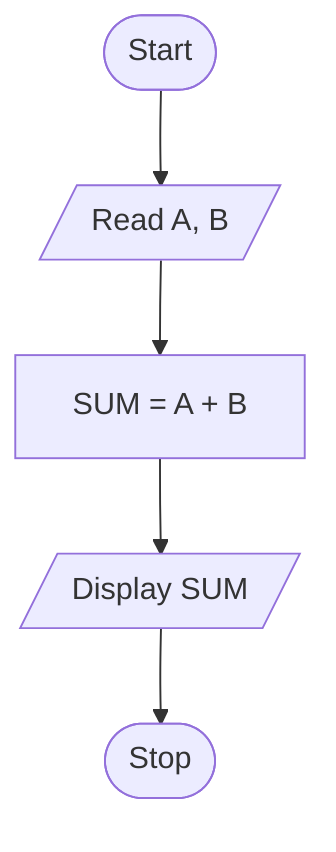

# What Is an Algorithm and Its Characteristics

An algorithm is a finite sequence of clear steps used to solve a problem. It accepts input, processes it logically, and produces the required output.

## Characteristics of an Algorithm

1. Definiteness: every step must be clear and unambiguous.
2. Input: it should accept zero or more inputs.
3. Output: it should produce at least one meaningful output.
4. Finiteness: it must stop after a finite number of steps.
5. Effectiveness: each step should be simple, practical, and executable.
6. Language independence: it is written in a general form and can be implemented in any programming language.

## Simple Example

Algorithm to find the sum of two numbers:

1. Start
2. Read `A` and `B`
3. Compute `SUM = A + B`
4. Display `SUM`
5. Stop

## Mermaid Diagram

