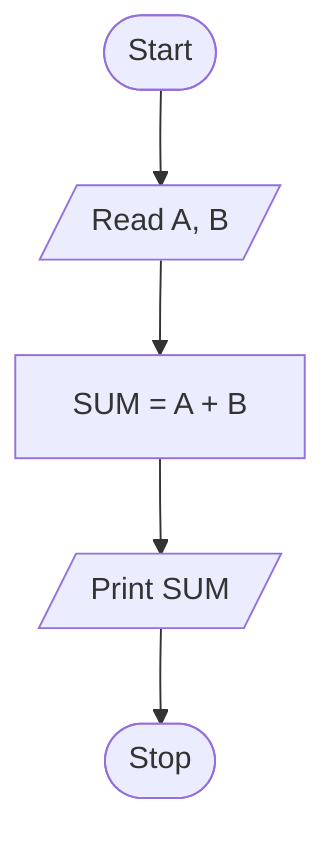

# Define Flowchart and Explain Symbols

A flowchart is the graphical representation of an algorithm. It uses standard symbols to show the sequence of operations in solving a problem.

## Common Flowchart Symbols

| Symbol | Name | Purpose |
| --- | --- | --- |
| Oval | Terminal | Start or stop |
| Parallelogram | Input/Output | Read or display data |
| Rectangle | Process | Calculation or instruction |
| Diamond | Decision | Condition check |
| Arrow | Flow line | Direction of control |
| Circle | Connector | Connect flow on the same page |
| Pentagon | Off-page connector | Connect flow to another page |
| Double rectangle | Predefined process | Call a subroutine |

## Example

Flowchart to add two numbers:

## Notes

- Flowcharts make logic easy to understand.
- They are useful for planning before writing a C program.
