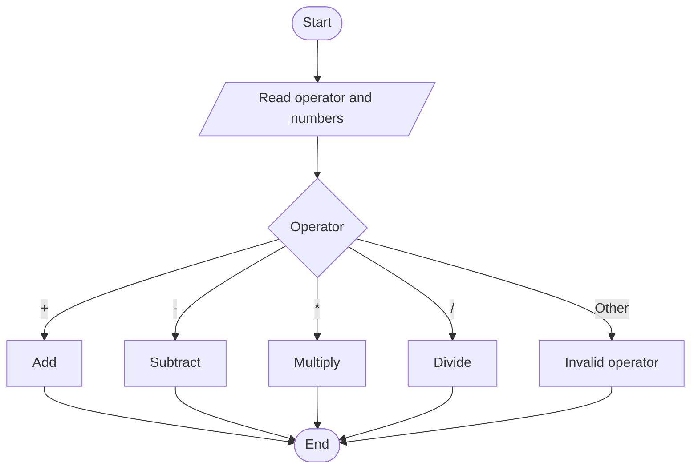

# Syntax of `switch` and Calculator Program

The `switch` statement is a multi-way decision control structure. It checks the value of an expression and executes the matching case.

## Syntax

```c
switch (expression) {
    case value1:
        statements;
        break;
    case value2:
        statements;
        break;
    default:
        statements;
}
```

## Mermaid Flowchart



## Calculator Program

```c
#include <stdio.h>

int main() {
    char op;
    float a, b;

    printf("Enter operator (+, -, *, /): ");
    scanf(" %c", &op);
    printf("Enter two numbers: ");
    scanf("%f %f", &a, &b);

    switch (op) {
        case '+':
            printf("Result = %.2f\n", a + b);
            break;
        case '-':
            printf("Result = %.2f\n", a - b);
            break;
        case '*':
            printf("Result = %.2f\n", a * b);
            break;
        case '/':
            printf("Result = %.2f\n", a / b);
            break;
        default:
            printf("Invalid operator\n");
    }
    return 0;
}
```
