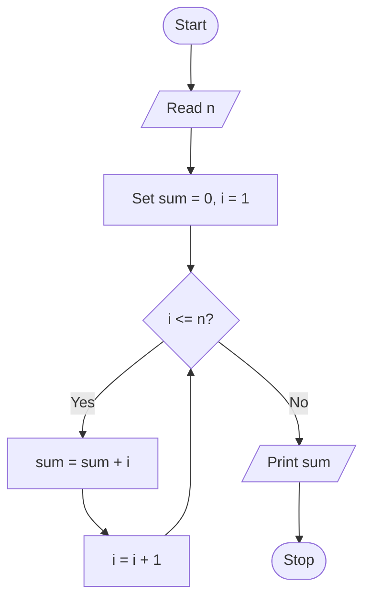

# C Program to Find the Sum of `n` Natural Numbers

The sum of the first `n` natural numbers can be found using a loop.

## Program

```c
#include <stdio.h>

int main() {
    int n, i, sum = 0;

    printf("Enter n: ");
    scanf("%d", &n);

    for (i = 1; i <= n; i++) {
        sum = sum + i;
    }

    printf("Sum = %d\n", sum);
    return 0;
}
```

## Sample Output

```text
Enter n: 5
Sum = 15
```

## idea


