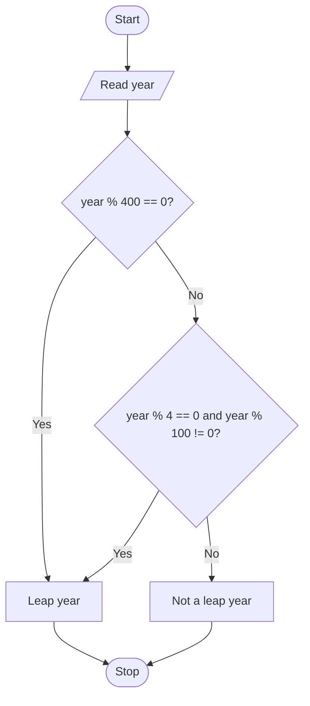

# C Program to Check Whether a Year Is a Leap Year

A year is a leap year if:

- it is divisible by 400, or
- it is divisible by 4 but not by 100.

## Program

```c
#include <stdio.h>

int main() {
    int year;

    printf("Enter a year: ");
    scanf("%d", &year);

    if ((year % 400 == 0) || (year % 4 == 0 && year % 100 != 0))
        printf("Leap year\n");
    else
        printf("Not a leap year\n");

    return 0;
}
```

## Mermaid Decision Flow


