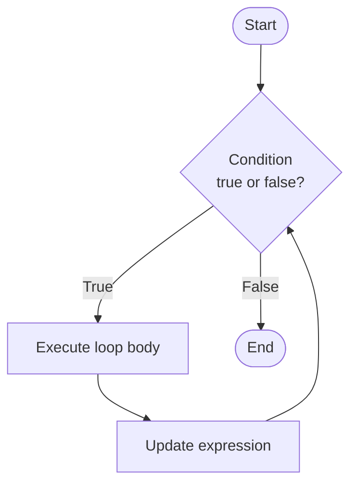
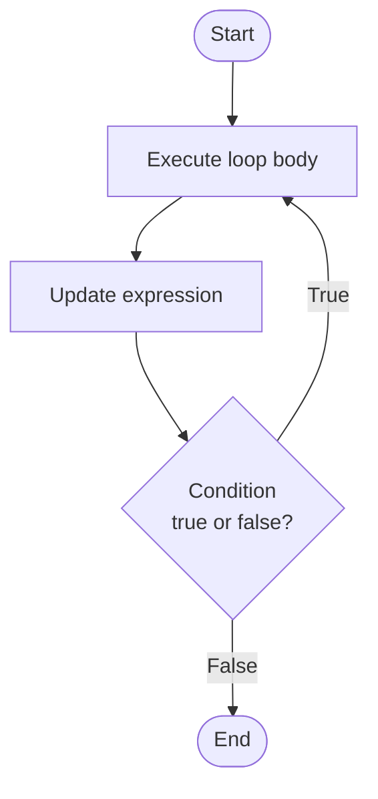

# While vs Do-While Loop

## 1. The `while` Loop

### Definition

The `while` loop is an **entry-controlled loop** — the condition is checked **before** executing the body. If the condition is false from the start, the body never executes even once.

### Syntax

```c
while (condition) {
    // statements
    // update expression
}
```

### Flowchart



### Example Program

```c
#include <stdio.h>

int main() {
    int i = 1;

    while (i <= 5) {
        printf("%d\n", i);
        i++;
    }

    return 0;
}
```

**Output:**

```
1
2
3
4
5
```

> [!note] Explanation
> 
> - `i` starts at 1. The condition `i <= 5` is checked first.
> - Each time it is true, the body prints `i` and increments it.
> - When `i` becomes 6, the condition is **false** and the loop exits.
> - If `i` were initialized to 10, the loop body would **never execute**.

---

## 2. The `do-while` Loop

### Definition

The `do-while` loop is an **exit-controlled loop** — the body is executed **first**, and the condition is checked **after**. This guarantees the loop body executes **at least once**, regardless of the condition.

### Syntax

```c
do {
    // statements
    // update expression
} while (condition);
```

> [!warning] Semicolon The `do-while` loop requires a **semicolon** after the closing `while (condition);` — unlike the `while` loop.

### Flowchart



### Example Program

```c
#include <stdio.h>

int main() {
    int i = 1;

    do {
        printf("%d\n", i);
        i++;
    } while (i <= 5);

    return 0;
}
```

**Output:**

```
1
2
3
4
5
```

> [!note] Explanation
> 
> - The body executes first — `i = 1` is printed.
> - After the body, the condition `i <= 5` is checked.
> - This repeats until `i` becomes 6, at which point the condition is false and the loop exits.

---

## 3. The Critical Difference — When Condition is False Initially

This example clearly shows the key difference between the two loops.

```c
#include <stdio.h>

int main() {
    int i = 10;   // condition i <= 5 is false from the start

    printf("--- while loop ---\n");
    while (i <= 5) {
        printf("while: %d\n", i);
        i++;
    }

    i = 10;  // reset

    printf("--- do-while loop ---\n");
    do {
        printf("do-while: %d\n", i);
        i++;
    } while (i <= 5);

    return 0;
}
```

**Output:**

```
--- while loop ---
--- do-while loop ---
do-while: 10
```

> [!important] Key Observation
> 
> - The `while` loop printed **nothing** — condition was false before entry.
> - The `do-while` loop printed **10 once** — body ran before the condition was checked.

---

## 4. Difference Table

|Feature|`while`|`do-while`|
|---|---|---|
|Type|Entry-controlled|Exit-controlled|
|Condition checked|**Before** the body|**After** the body|
|Minimum executions|**0** (may never run)|**1** (always runs once)|
|Semicolon after condition|Not required|**Required** `;`|
|Use case|When execution depends on condition|When body must run at least once|
|Syntax end|`}`|`} while (condition);`|

---

## 5. When to Use Which

> [!tip] Decision Guide
> 
> - Use **`while`** when you are not sure if the loop should run at all — e.g. reading a file, waiting for valid input from a stream.
> - Use **`do-while`** when the body must execute at least once — e.g. showing a menu to a user, validating user input where you need to ask at least once.

### Real-world Example — Input Validation with `do-while`

```c
#include <stdio.h>

int main() {
    int age;

    do {
        printf("Enter a valid age (1-120) : ");
        scanf("%d", &age);
    } while (age < 1 || age > 120);

    printf("Age entered : %d\n", age);
    return 0;
}
```

> [!note] Why `do-while` here? The user must be asked for input **at least once** before validation can happen. A `while` loop would require reading input before the loop, which is redundant. `do-while` is the natural fit.

---

## Quick Revision

> [!summary] Summary
> 
> - **`while`** → checks condition **first** → may execute **zero times**.
> - **`do-while`** → executes body **first** → runs **at least once**.
> - Both require an **update expression** inside the body to avoid infinite loops.
> - `do-while` needs a **semicolon** after `while (condition)`.
> - The only time they behave differently is when the condition is **false initially**.