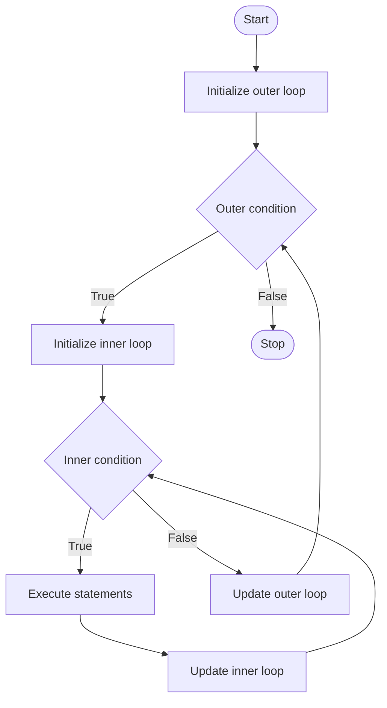

A nested `for` loop means one `for` loop inside another `for` loop. It is commonly used for patterns, tables, and matrix operations.

## Syntax

```c
for (initialization1; condition1; update1) {
    for (initialization2; condition2; update2) {
        statements;
    }
}
```

## Mermaid Flowchart



## Example Program

```c
#include <stdio.h>

int main() {
    int i, j;

    for (i = 1; i <= 3; i++) {
        for (j = 1; j <= 3; j++) {
            printf("%d ", j);
        }
        printf("\n");
    }
    return 0;
}
```

## Output

```text
1 2 3
1 2 3
1 2 3
```
