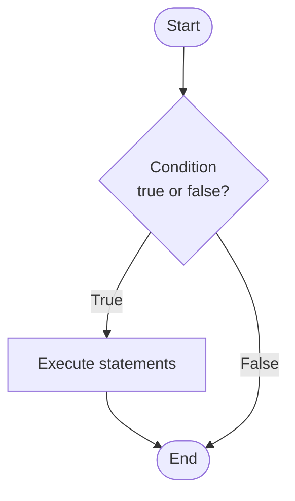
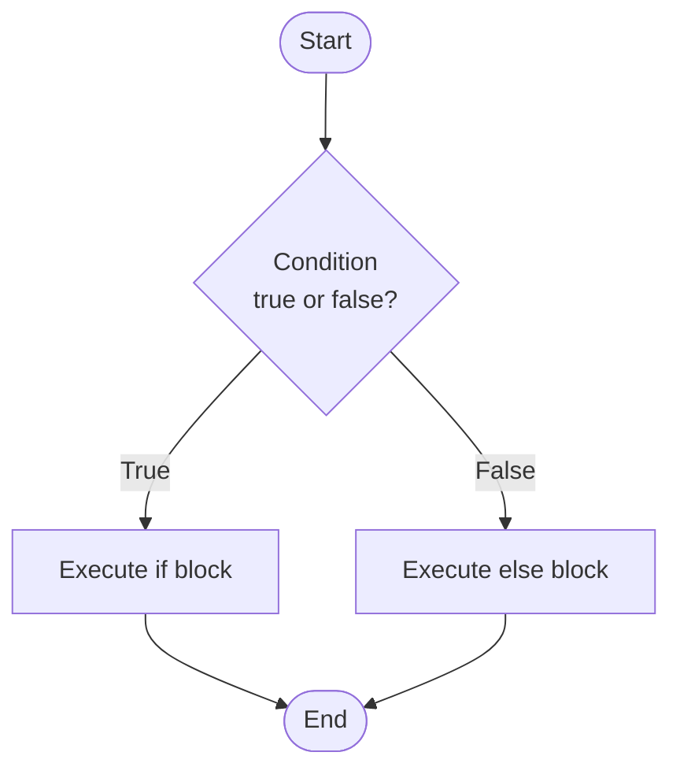
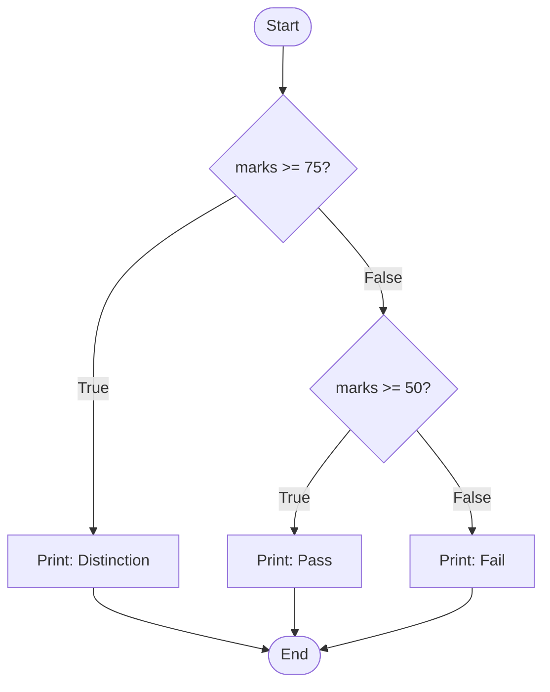

## 1. The `if` Statement

### Definition

The `if` statement is a **conditional control structure** that executes a block of code **only when the given condition is true**. If the condition evaluates to false, the block is skipped entirely.

### Syntax

```c
if (condition) {
    // statement(s) to execute when condition is true
}
```

### Flowchart



### Example Program

```c
#include <stdio.h>

int main() {
    int marks = 75;

    if (marks >= 50) {
        printf("Student has passed.\n");
    }

    return 0;
}
```

**Output:**

```
Student has passed.
```

> [!note] Explanation `marks = 75` and `75 >= 50` is **true**, so the print statement executes. If marks were 40, the condition would be false and nothing would be printed.

---

## 2. The `if-else` Statement

### Definition

The `if-else` statement provides **two execution paths** — one for when the condition is **true**, and another for when it is **false**. It guarantees that exactly one of the two blocks will always execute.

### Syntax

```c
if (condition) {
    // executed when condition is true
} else {
    // executed when condition is false
}
```

### Flowchart



### Example Program

```c
#include <stdio.h>

int main() {
    int number = -5;

    if (number >= 0) {
        printf("The number is positive or zero.\n");
    } else {
        printf("The number is negative.\n");
    }

    return 0;
}
```

**Output:**

```
The number is negative.
```

> [!note] Explanation `number = -5` and `-5 >= 0` is **false**, so the `else` block executes.

---

## 3. Nested `if-else`

When an `if-else` is placed inside another `if` or `else` block, it is called **nested if-else**. Used when there are more than two possible outcomes.

### Syntax

```c
if (condition1) {
    // executed when condition1 is true
} else if (condition2) {
    // executed when condition2 is true
} else {
    // executed when all conditions are false
}
```

### Flowchart



### Example Program

```c
#include <stdio.h>

int main() {
    int marks = 62;

    if (marks >= 75) {
        printf("Distinction\n");
    } else if (marks >= 50) {
        printf("Pass\n");
    } else {
        printf("Fail\n");
    }

    return 0;
}
```

**Output:**

```
Pass
```

> [!note] Explanation Conditions are checked **top to bottom**. The first true condition executes its block and the rest are skipped.

---

## 4. Key Differences

|Feature|`if`|`if-else`|
|---|---|---|
|Execution paths|1 (true only)|2 (true and false)|
|Execution guarantee|Only if condition is true|Always executes one block|
|Use case|Optional action|Choosing between two actions|

---

## 5. Important Points

> [!tip] Exam Tips
> 
> - The condition must be a **boolean expression** (evaluates to true/false).
> - In C, **any non-zero value is true** and **zero is false**.
> - Curly braces `{}` are optional for a single statement, but always recommended.
> - `else` **cannot exist** without a preceding `if`.
> - In `else-if` chains, only the **first matching** condition executes.

---

## Quick Revision

> [!summary] Summary
> 
> - **`if`** → runs a block only when condition is **true**.
> - **`if-else`** → runs one of two blocks based on **true or false**.
> - **Nested `if-else`** → handles **multiple conditions** in sequence.
> - Flowchart symbols: oval = start/end, diamond = decision, rectangle = action.