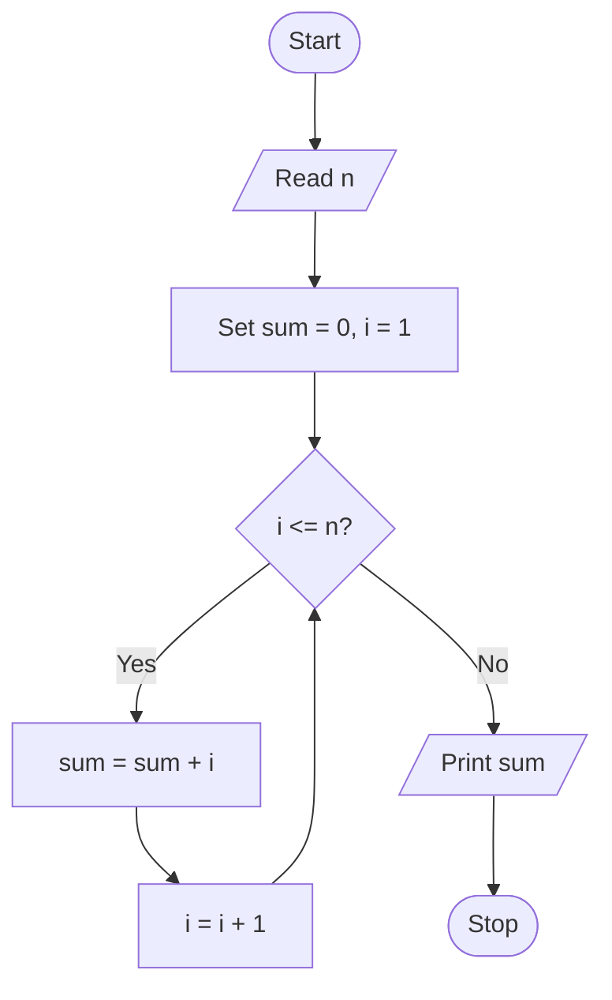

The sum of the first `n` natural numbers can be found using a loop.

## Program

```c
#include <stdio.h>

int main() {
    int n,add,multiply;

    printf("Enter n: ");
    scanf("%d", &n);

    add = n+1;  // formula is n(n+1)/2
    multiply = n*add;
    div = multiply/2;
    

    printf("Sum = %d\n", div);
    return 0;
}
```

## Sample Output

```text
Enter n: 5
Sum = 15
```

## idea


