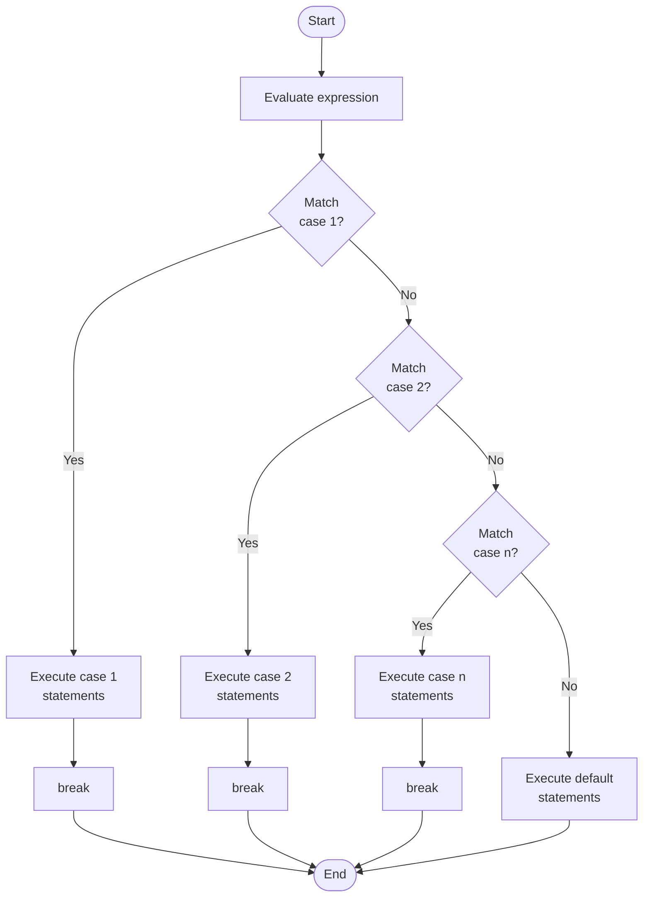

## 1. Syntax

```c
switch (expression) {
    case value1:
        // statements
        break;

    case value2:
        // statements
        break;

    case value3:
        // statements
        break;

    default:
        // statements executed if no case matches
}
```

### Syntax Rules

> [!tip] Key Rules
> 
> - The **expression** inside `switch()` must evaluate to an **integer or character**.
> - Each **`case`** label must be a **constant value** — no variables or expressions.
> - The **`break`** statement exits the switch block. Without it, execution **falls through** to the next case.
> - The **`default`** case is optional but recommended — it handles all unmatched values.
> - Two cases **cannot have the same value**.

---

## 2. Flowchart



---

## 3. How It Works

| Step | What Happens                                                         |
| ---- | -------------------------------------------------------------------- |
| 1    | The `switch` evaluates the **expression** once                       |
| 2    | The result is **compared** with each `case` value from top to bottom |
| 3    | When a **match is found**, that case's statements execute            |
| 4    | `break` exits the switch block                                       |
| 5    | If **no match** is found, the `default` block executes               |

---

## 4. Calculator Program Using Switch Case

### Problem Statement

Write a C program that takes two numbers and an operator (`+`, `-`, `*`, `/`) from the user and performs the corresponding arithmetic operation using `switch case`.

### Program

```c
#include <stdio.h>

int main() {
    float a, b, result;
    char op;

    printf("Enter calculation : ");
    scanf("%f%c%f", &a,&op,&b);


    switch (op) {
        case '+':
            result = a + b;
            printf("Result : %.2f\n", result);
            break;

        case '-':
            result = a - b;
            printf("Result : %.2f\n", result);
            break;

        case '*':
            result = a * b;
            printf("Result : %.2f\n", result);
            break;

        case '/':
                result = a / b;
                printf("Result : %.2f\n", result);
            break;
        default:
            printf("Error : Invalid operator entered.\n");
    }

    return 0;
}
```

---

### Sample Runs

**Run 1 — Addition:**

```
Enter first number  : 10
Enter operator      : +
Enter second number : 5
Result : 15.00
```

**Run 2 — Division:**

```
Enter first number  : 9
Enter operator      : /
Enter second number : 2
Result : 4.50
```

**Run 3 — Division by Zero:**

```
Enter first number  : 8
Enter operator      : /
Enter second number : 0
Error : Division by zero is not allowed.
```

**Run 4 — Invalid Operator:**

```
Enter first number  : 5
Enter operator      : %
Enter second number : 3
Error : Invalid operator entered.
```

---

### Program Explanation

> [!note] Line-by-Line Explanation
> 
> - `double a, b` → stores the two operands (supports decimals).
> - `char op` → stores the operator character entered by the user.
> - `scanf(" %c", &op)` → the **space before `%c`** clears the newline left in the input buffer.
> - Each `case` matches one operator and performs the corresponding operation.
> - The `'/'` case includes a **division by zero check** using an inner `if` statement.
> - `default` handles any invalid operator that doesn't match any case.
> - `%.2f` prints the result with **2 decimal places**.

---

## 5. Switch Case vs If-Else

| Feature            | Switch Case                    | If-Else                                  |
| ------------------ | ------------------------------ | ---------------------------------------- |
| Expression type    | Integer or character only      | Any boolean expression                   |
| Readability        | Cleaner for many fixed values  | Better for ranges and complex conditions |
| Fall-through       | Yes (if `break` is missing)    | No                                       |
| `default` / `else` | Optional                       | Optional                                 |
| Speed              | Slightly faster for many cases | Slightly slower for many cases           |

---

## Quick Revision

> [!summary] Summary
> 
> - `switch` evaluates an expression and **jumps** to the matching `case`.
> - `break` is essential — without it, execution falls into the **next case**.
> - `default` acts like the final `else` — catches all unmatched values.
> - Switch case is ideal when a variable is compared against **multiple fixed constant values**.
> - The calculator program uses `char` type for the operator and `double` for decimal support.