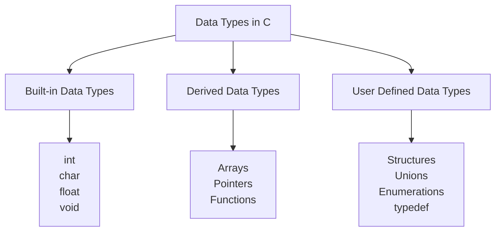
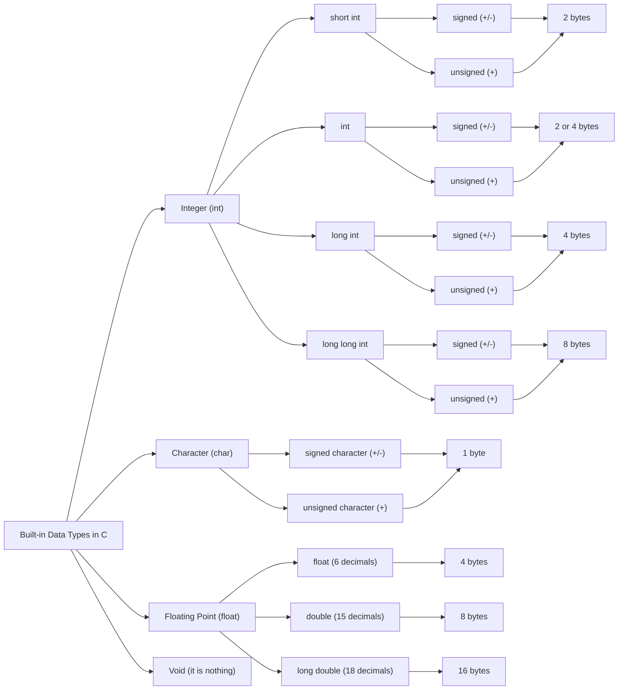

# **Data Type in C**

## **Definition**

A **data type** specifies **what kind of value a variable can store**, how much **memory** it occupies, and what **operations** can be performed on it.

**Example:**

`int a`

Here `int` is the data type and `a` is the variable.

---

## **Primitive (Built-in) Data Types in C**

Primitive data types are the **basic data types provided by C**.

They are:

1. `int`
    
2. `char`
    
3. `float`
    
4. `double`
    
5. `void`
    

---

## **1. Integer (`int`)**

Used to store **whole numbers**.

### Types:

- short int
    
- int
    
- long int
    
- long long int
    

Each can be **signed** (+/–) or **unsigned** (+ only).

|Type|Memory|Example|
|---|---|---|
|short int|2 bytes|`short a;`|
|int|2 or 4 bytes|`int b;`|
|long int|4 bytes|`long c;`|
|long long int|8 bytes|`long long d;`|

_(Memory depends on compiler)_

**Example:**

int age = 20;

---

## **2. Character (`char`)**

Stores **single character**.

- Requires **1 byte**
    
- Can be signed or unsigned
    

**Example:**

char grade = 'A';

---

## **3. Floating Point (`float`)**

Stores **decimal values**.

|Type|Memory|Precision|
|---|---|---|
|float|4 bytes|~6 digits|
|double|8 bytes|~15 digits|
|long double|16 bytes|~18 digits|

**Examples:**

float pi = 3.14;  
double value = 23.456789;

Used when fractions are needed.

---

## **4. Void (`void`)**

Means **nothing**.

Used when:

- A function returns nothing
    
- No parameters
    

**Example:**

void display()  
{  
}

---

## **Conclusion**

Primitive data types form the **foundation of C programming**.  
They control **memory usage**, **precision**, and **data behavior**, making programs efficient and structured.