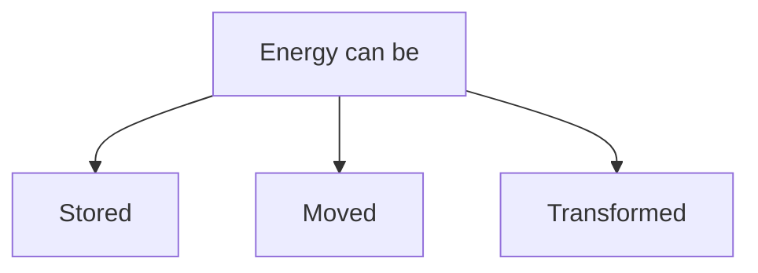

Ability of a [[System]] to do [[Work (W)|work]] or *cause change.*

- Energy can be *stored*, *moved*, or *transformed*.
- it is not a magical power, and is a measurable quantity.

Energy can be kinetic [[Energy interaction|moving]] or potential *stored*, and exists in [[Forms of Energies|various forms of energies]] such as thermal, chemical, electrical, nuclear, mechanical, sound, and light energy, and also can be *transformed* from one form to another.

NOTE: stored energy is the form of energy when we talk about energy inside the system, and when that stored energy moves it either can move as [[Heat (Q)]] or [[Work (W)]], which is [[Energy interaction]]

---
#### SI Units:
$$ Joule = N.m $$
Ref: [[Joule]]

---
## Facts:
- **Energy is conserved**
- it cannot be created or destroyed, but only can change from one form to another form.
- *You cannot see the Energy, but can only see it's effects.*

---
---
---

